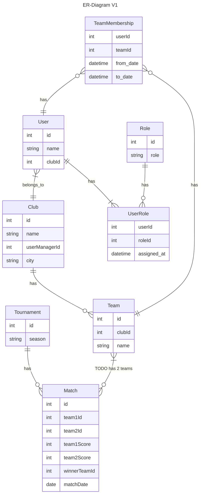
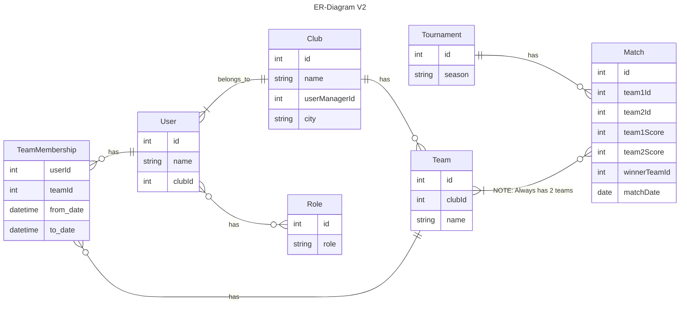

# Design

Vores backend er designet ud fra valg vi har taget med db, api endpoint og ER-Diagrammer.

## DB

Til vores db er der valgt postgresql, da vi arbejder med relationelle data. Der skal ikke være for 
mange alterationer af vores modeller, og modeller skal følge de skemaer vi har besluttet. Der skal
ikke kunne tilføjes noget til en entity, som en anden måske ikke har. Derfor er der ikke valgt NoSQL 
men en SQL database. Postgres er valgt da den følger ACID-principper meget striks

## API

CREATE TABLE public.users
(
id serial NOT NULL,
email text NOT NULL UNIQUE,
password_hash text NOT NULL,
role text[] DEFAULT ARRAY['user'],
PRIMARY KEY (id)
);

ALTER TABLE IF EXISTS public.users
OWNER to postgres;

## ER-Diagram

Vores backend er designet med dette ER-Diagram.

