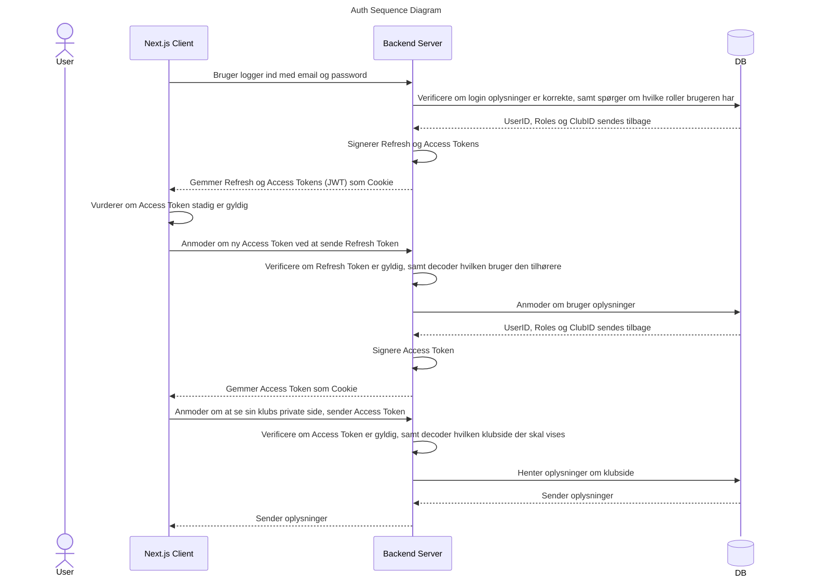

```mermaid
---
title: Auth Sequence Diagram
---
sequenceDiagram
    actor User
    participant Client as Next.js Client
    participant Server As Backend Server
    participant DB@{ "type" : "database" }

    Client->>Server: Bruger logger ind med email og password
    Server->>DB: Verificere om login oplysninger er korrekte, samt spørger om hvilke roller brugeren har
    DB-->>Server: UserID, Roles og ClubID sendes tilbage
    Server->>Server: Signerer Refresh og Access Tokens
    Server-->>Client: Gemmer Refresh og Access Tokens (JWT) som Cookie

    Client->>Client: Vurderer om Access Token stadig er gyldig
    Client->>Server: Anmoder om ny Access Token ved at sende Refresh Token
    Server->>Server: Verificere om Refresh Token er gyldig, samt decoder hvilken bruger den tilhørere
    Server->>DB: Anmoder om bruger oplysninger
    DB-->>Server: UserID, Roles og ClubID sendes tilbage
    Server->>Server: Signere Access Token
    Server-->>Client: Gemmer Access Token som Cookie

    Client->>Server: Anmoder om at se sin klubs private side, sender Access Token
    Server->>Server: Verificere om Access Token er gyldig, samt decoder hvilken klubside der skal vises
    Server->>DB: Henter oplysninger om klubside
    DB-->>Server: Sender oplysninger
    Server-->>Client: Sender oplysninger


```