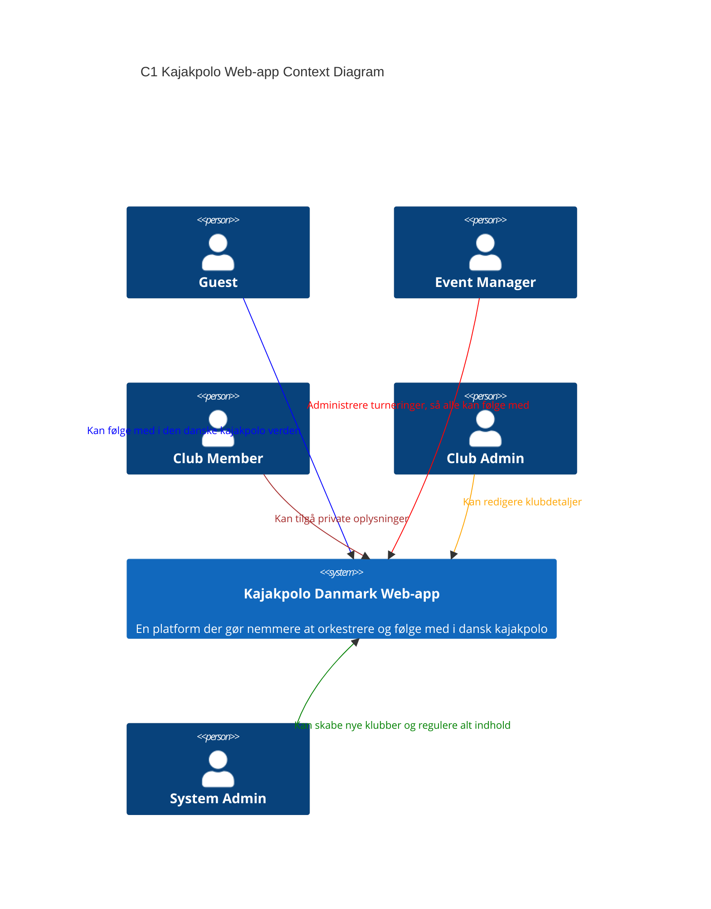
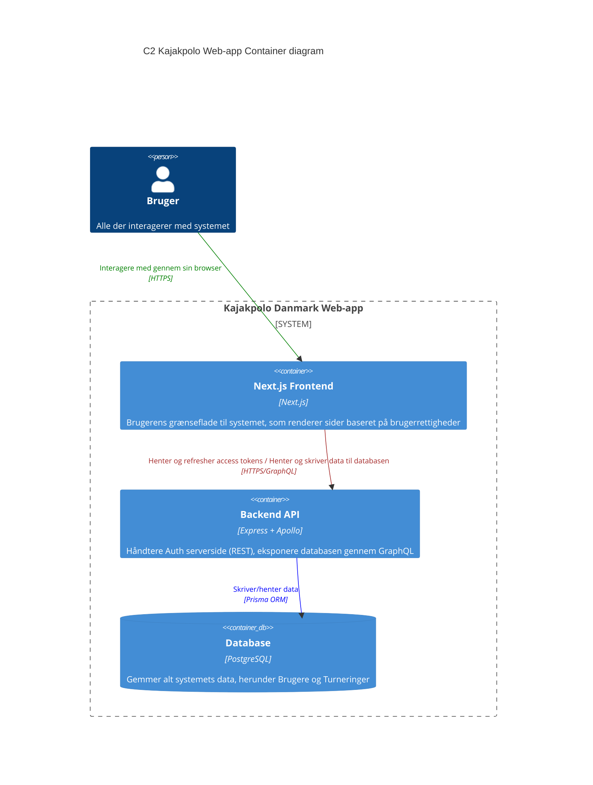
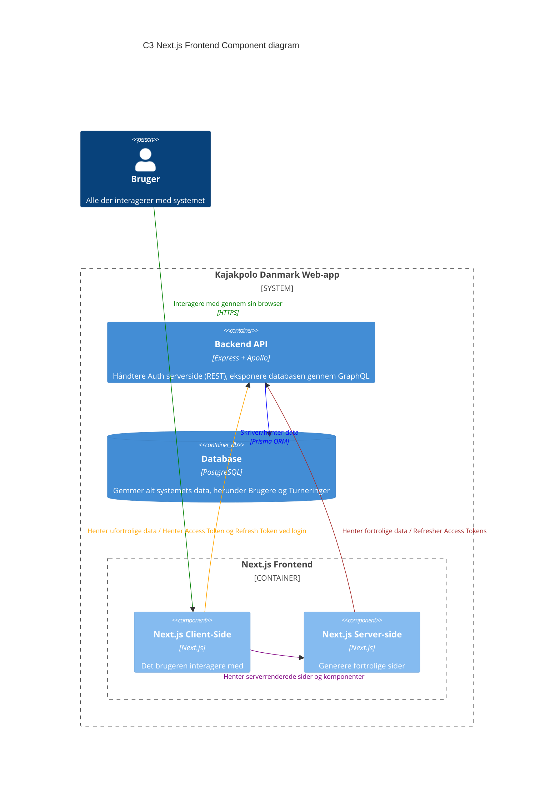
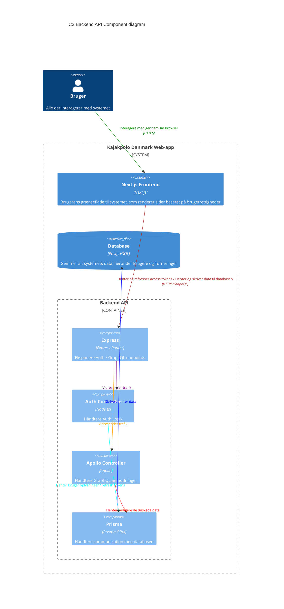

```mermaid
C4Context
title C1 Kajakpolo Web-app Context Diagram

Person(guest, "Guest")
    Rel(guest, system, "Kan følge med i den danske kajakpolo verden")
    UpdateRelStyle(guest, system, $textColor="blue", $lineColor="blue", $offsetX="-250")

Person(eventManager, "Event Manager")
    Rel(eventManager, system, "Administrere turneringer, så alle kan følge med")
    UpdateRelStyle(eventManager, system, $textColor="red", $lineColor="red", $offsetX="-150", $offsetY="-30")


Person(clubMember, "Club Member")
    Rel(clubMember, system, "Kan tilgå private oplysninger")
    UpdateRelStyle(clubMember, system, $textColor="brown", $lineColor="brown", $offsetX="-50", $offsetY="0")

Person(clubAdmin, "Club Admin")
    Rel(clubAdmin, system, "Kan redigere klubdetaljer")
    UpdateRelStyle(clubAdmin, system, $textColor="orange", $lineColor="orange", $offsetX="0", $offsetY="-20")

System(system, "Kajakpolo Danmark Web-app", "En platform der gør nemmere at orkestrere og følge med i dansk kajakpolo")

Person(systemAdmin, "System Admin")
    Rel(systemAdmin, system, "Kan skabe nye klubber og regulere alt indhold")
    UpdateRelStyle(systemAdmin, system, $textColor="green", $lineColor="green", $offsetX="-40", $offsetY="50")

```

```mermaid
C4Container
title C2 Kajakpolo Web-app Container diagram


Person(user, "Bruger", "Alle der interagerer med systemet")
    Rel(user, next, "Interagere med gennem sin browser", "HTTPS")
    UpdateRelStyle(user, next, $textColor="green", $lineColor="green", $offsetX="-250", $offsetY="-50")

System_Boundary(system_boundary, "Kajakpolo Danmark Web-app") {
    Container(next, "Next.js Frontend", "Next.js", "Brugerens grænseflade til systemet, som renderer sider baseret på brugerrettigheder")
        Rel(next, api, "Henter og refresher access tokens / Henter og skriver data til databasen", "HTTPS/GraphQL")
        UpdateRelStyle(next, api, $textColor="brown", $lineColor="brown", $offsetX="-300", $offsetY="0")

    Container(api, "Backend API", "Express + Apollo", "Håndtere Auth serverside (REST), eksponere databasen gennem GraphQL")
        Rel(api, db, "Skriver/henter data", "Prisma ORM")
        UpdateRelStyle(api, db, $textColor="blue", $lineColor="blue", $offsetX="-110", $offsetY="0")

    ContainerDb(db, "Database", "PostgreSQL", "Gemmer alt systemets data, herunder Brugere og Turneringer")
   UpdateLayoutConfig("1")
}
```

```mermaid
C4Component
title C3 Next.js Frontend Component diagram

Person(user, "Bruger", "Alle der interagerer med systemet")
    Rel(user, nextCS, "Interagere med gennem sin browser", "HTTPS")
    UpdateRelStyle(user, nextCS, $textColor="green", $lineColor="green", $offsetX="0", $offsetY="-200")
    

System_Boundary(system_boundary, "Kajakpolo Danmark Web-app") {
    Container_Boundary(next_boundary, "Next.js Frontend") {
        Component(nextCS, "Next.js Client-Side", "Next.js", "Det brugeren interagere med")
            Rel(nextCS, nextSS, "Henter serverrenderede sider og komponenter")
            UpdateRelStyle(nextCS, nextSS, $textColor="purple", $lineColor="purple", $offsetX="-100", $offsetY="40")
            Rel(nextCS, api, "Henter ufortrolige data / Henter Access Token og Refresh Token ved login")
            UpdateRelStyle(nextCS, api, $textColor="orange", $lineColor="orange", $offsetX="-260", $offsetY="60")

        Component(nextSS, "Next.js Server-side", "Next.js", "Generere fortrolige sider")
            Rel(nextSS, api, "Henter fortrolige data / Refresher Access Tokens")
            UpdateRelStyle(nextSS, api, $textColor="brown", $lineColor="brown", $offsetX="60", $offsetY="60")
    }

    Container(api, "Backend API", "Express + Apollo", "Håndtere Auth serverside (REST), eksponere databasen gennem GraphQL")
        Rel(api, db, "Skriver/henter data", "Prisma ORM")
        UpdateRelStyle(api, db, $textColor="blue", $lineColor="blue", $offsetX="-50", $offsetY="40")

    ContainerDb(db, "Database", "PostgreSQL", "Gemmer alt systemets data, herunder Brugere og Turneringer")
    
    UpdateLayoutConfig("0")
}
```

```mermaid
C4Component
title C3 Backend API Component diagram

Person(user, "Bruger", "Alle der interagerer med systemet")
    Rel(user, next, "Interagere med gennem sin browser", "HTTPS")
    UpdateRelStyle(user, next, $textColor="green", $lineColor="green", $offsetX="0", $offsetY="-50")

System_Boundary(system_boundary, "Kajakpolo Danmark Web-app") {
    Container(next, "Next.js Frontend", "Next.js", "Brugerens grænseflade til systemet, som renderer sider baseret på brugerrettigheder")
        Rel(next, express, "Henter og refresher access tokens / Henter og skriver data til databasen", "HTTPS/GraphQL")
        UpdateRelStyle(next, express, $textColor="brown", $lineColor="brown", $offsetX="-50", $offsetY="40")


    Container_Boundary(api_boundary, "Backend API") {
        Component(express, "Express", "Express Router", "Eksponere Auth / GraphQL endpoints")
            Rel(express, auth, "Vidresender trafik")
            UpdateRelStyle(express, auth, $textColor="purple", $lineColor="purple", $offsetX="-50", $offsetY="40")
            Rel(express, apollo, "Vidresender trafik")
            UpdateRelStyle(express, apollo, $textColor="orange", $lineColor="orange", $offsetX="-50", $offsetY="60")

        Component(auth, "Auth Controller", "Node.ts", "Håndtere Auth Logik")
            Rel(auth, prisma, "Henter Bruger oplysninger / refresh tokens")
            UpdateRelStyle(auth, prisma, $textColor="cyan", $lineColor="cyan", $offsetX="-200", $offsetY="60")

        Component(apollo, "Apollo Controller", "Apollo", "Håndtere GraphQL anmodninger")
            Rel(apollo, prisma, "Henter/redigere de ønskede data")
             UpdateRelStyle(apollo, prisma, $textColor="red", $lineColor="red", $offsetX="-50", $offsetY="40")

        Component(prisma, "Prisma", "Prisma ORM", "Håndtere kommunikation med databasen")
            Rel(prisma, db, "Skriver/henter data")
            UpdateRelStyle(prisma, db, $textColor="blue", $lineColor="blue", $offsetX="-50", $offsetY="40")
    }

    ContainerDb(db, "Database", "PostgreSQL", "Gemmer alt systemets data, herunder Brugere og Turneringer")

    UpdateLayoutConfig("0")
}
```

