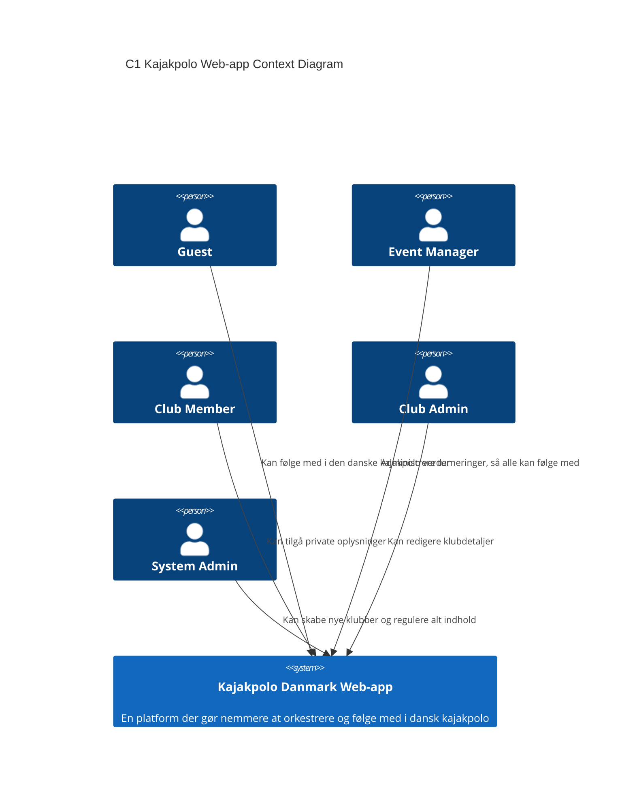
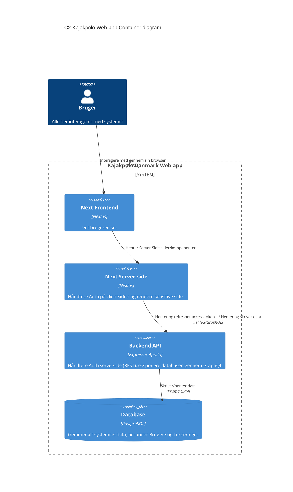
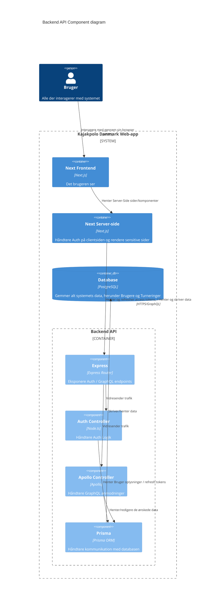

```mermaid

C4Context
title C1 Kajakpolo Web-app Context Diagram

Person(guest, "Guest")
    Rel(guest, system, "Kan følge med i den danske kajakpolo verden")

Person(eventManager, "Event Manager")
    Rel(eventManager, system, "Administrere turneringer, så alle kan følge med")

Person(clubMember, "Club Member")
    Rel(clubMember, system, "Kan tilgå private oplysninger")

Person(clubAdmin, "Club Admin")
    Rel(clubAdmin, system, "Kan redigere klubdetaljer")

Person(systemAdmin, "System Admin")
    Rel(systemAdmin, system, "Kan skabe nye klubber og regulere alt indhold")

System(system, "Kajakpolo Danmark Web-app", "En platform der gør nemmere at orkestrere og følge med i dansk kajakpolo")


```

```mermaid


C4Container
title C2 Kajakpolo Web-app  Container diagram

Person(user, "Bruger", "Alle der interagerer med systemet")
    Rel(user, nextFE, "Interagere med gennem sin browser", "HTTPS")

System_Boundary(system_boundary, "Kajakpolo Danmark Web-app") {
    Container(nextFE, "Next Frontend", "Next.js", "Det brugeren ser")
        Rel(nextFE, nextSS, "Henter Server-Side sider/komponenter", "")

    Container(nextSS, "Next Server-side", "Next.js", "Håndtere Auth på clientsiden og rendere sensitive sider")
        Rel(nextSS, api, "Henter og refresher access tokens, / Henter og skriver data", "HTTPS/GraphQL")


    Container(api, "Backend API", "Express + Apollo", "Håndtere Auth serverside (REST), eksponere databasen gennem GraphQL")
        Rel(api, db, "Skriver/henter data", "Prisma ORM")


    ContainerDb(db, "Database", "PostgreSQL", "Gemmer alt systemets data, herunder Brugere og Turneringer")

}


```

```mermaid


C4Component
title Backend API Component diagram

Person(user, "Bruger", "Alle der interagerer med systemet")
    Rel(user, nextFE, "Interagere med gennem sin browser", "HTTPS")

System_Boundary(system_boundary, "Kajakpolo Danmark Web-app") {
    Container(nextFE, "Next Frontend", "Next.js", "Det brugeren ser")
        Rel(nextFE, nextSS, "Henter Server-Side sider/komponenter", "")

    Container(nextSS, "Next Server-side", "Next.js", "Håndtere Auth på clientsiden og rendere sensitive sider")
        Rel(nextSS, express, "Henter og refresher access tokens, / Henter og skriver data", "HTTPS/GraphQL")


    Container_Boundary(api_boundary, "Backend API") {
        Component(express, "Express", "Express Router", "Eksponere Auth / GraphQL endpoints")
            Rel(express, auth, "Vidresender trafik")
            Rel(express, apollo, "Vidresender trafik")

        Component(auth, "Auth Controller", "Node.ts", "Håndtere Auth Logik")
            Rel(auth, prisma, "Henter Bruger oplysninger / refresh tokens")

        Component(apollo, "Apollo Controller", "Apollo", "Håndtere GraphQL anmodninger")
            Rel(apollo, prisma, "Henter/redigere de ønskede data")

        Component(prisma, "Prisma", "Prisma ORM", "Håndtere kommunikation med databasen")
            Rel(prisma, db, "Skriver/henter data")
    }

    ContainerDb(db, "Database", "PostgreSQL", "Gemmer alt systemets data, herunder Brugere og Turneringer")
}

```
